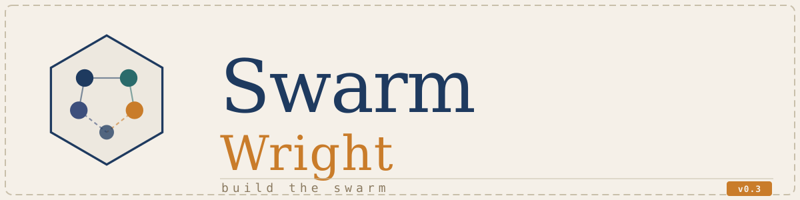

<p align="center">
  
</p>

# SwarmWright

A self-hosted multi-agent orchestration platform. Build teams of AI agents that handle administrative and interpretive work — governed by a strict topology where every connection is declared, every action is auditable.

Agents don't call each other freely. You define who talks to whom, what triggers a run, and what requires human sign-off. SwarmWright enforces it.

---

## Quick start

```bash
docker run -d \
  --network=host \
  --name swarmwright \
  -v ./data:/data \
  -e LLM_PROVIDER=anthropic \
  -e LLM_MODEL=claude-opus-4-7 \
  -e ANTHROPIC_API_KEY=sk-ant-... \
  ralphbarendse/swarmwright:latest
```

Then open `http://localhost:5001`.

Or with Docker Compose — copy `docker/docker-compose.yml` and a `.env` (see `.env.example`):

```bash
cp .env.example .env
# Fill in LLM_PROVIDER, LLM_MODEL, and your API key
docker compose -f docker/docker-compose.yml up -d
```

---

## What it does

You build **swarms** — named groups of agents, each with a written constitution describing their role, tools, and behaviour. Swarms live inside **workspaces** (think departments). A company-wide layer sits above everything.

A run starts when an event fires — on a schedule, via webhook, or manually. The runtime walks the declared topology, calls each agent in turn, logs every step, and surfaces anything that needs a human decision to the Inbox.

The GUI covers the full lifecycle:

- **Org** — manage workspaces and swarms
- **Swarm canvas** — drag-and-drop agent topology editor
- **Constitution editor** — write agent roles in plain Markdown with a live preview
- **Control Room** — monitor active and historical runs per swarm, fire events manually, pause swarms
- **Inbox** — human-in-the-loop approvals and escalations
- **Library** — manage knowledge documents, skills, and triggers across scopes
- **Settings** — LLM provider, model, branding, API keys stored encrypted at rest

---

## Features

- Topology-enforced agent graphs — agents can only call or inform peers you explicitly wire up
- Three-scope resource resolver: swarm → workspace → company, unqualified references auto-resolve
- Scheduled and webhook triggers with cron expressions
- Full run trace with per-step input/output logging
- Human-in-the-loop escalation with inbox approvals
- Encrypted secret storage (Fernet, key auto-generated on first boot)
- File-backed configuration — workspaces, agents, and constitutions are plain files you can version
- Single Docker container, SQLite by default, no external dependencies

---

## Environment variables

| Variable | Required | Default | Description |
|---|---|---|---|
| `LLM_PROVIDER` | Yes | `anthropic` | `anthropic` or `openai` |
| `LLM_MODEL` | Yes | `claude-opus-4-7` | Model identifier |
| `ANTHROPIC_API_KEY` | If provider=anthropic | — | Anthropic API key |
| `OPENAI_API_KEY` | If provider=openai | — | OpenAI API key |
| `SWARM_ENCRYPTION_KEY` | No | auto-generated | Fernet master key. If unset, generated on first boot and written to `<DATA_DIR>/.encryption_key`. Back this file up alongside `swarm.db`. |
| `DATABASE_URL` | No | `sqlite:////data/swarm.db` | SQLAlchemy connection URL |
| `DATA_DIR` | No | `/data` | Path to the data volume |
| `LOG_LEVEL` | No | `INFO` | `DEBUG` / `INFO` / `WARNING` / `ERROR` |
| `SCHEDULER_TIMEZONE` | No | `Europe/Amsterdam` | Timezone for cron triggers |

---

## Data volume

Everything that survives a container rebuild lives in the mounted `/data` directory:

```
data/
├── swarm.db                  — SQLite database
├── .encryption_key           — Master key (back this up)
├── company/                  — Company-wide knowledge, skills, perceptionists
└── workspaces/
    └── <workspace>/
        ├── knowledge/
        ├── skills/
        └── swarms/
            └── <swarm>/
                ├── meta.yaml
                ├── hierarchy.json    — topology definition
                └── agents/           — constitution .md files
```

The `hierarchy.json` file is the source of truth for a swarm's topology. The GUI writes it; you can also edit it directly and the runtime picks up changes live.
